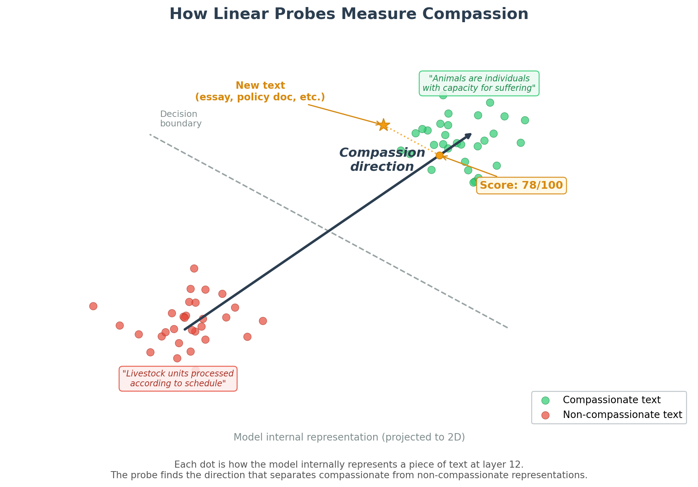
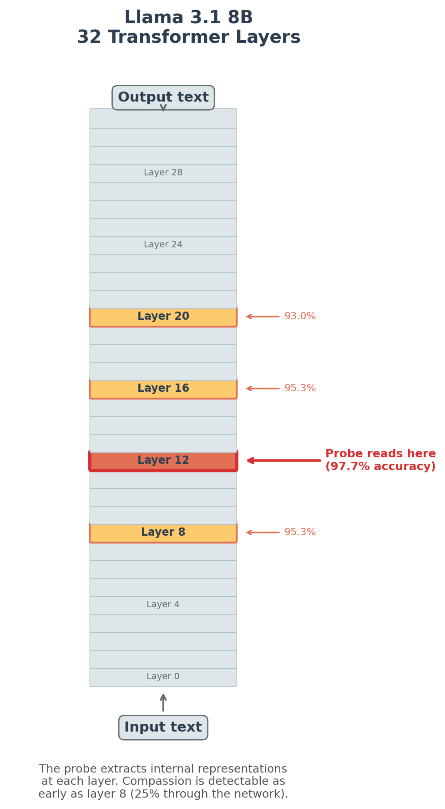
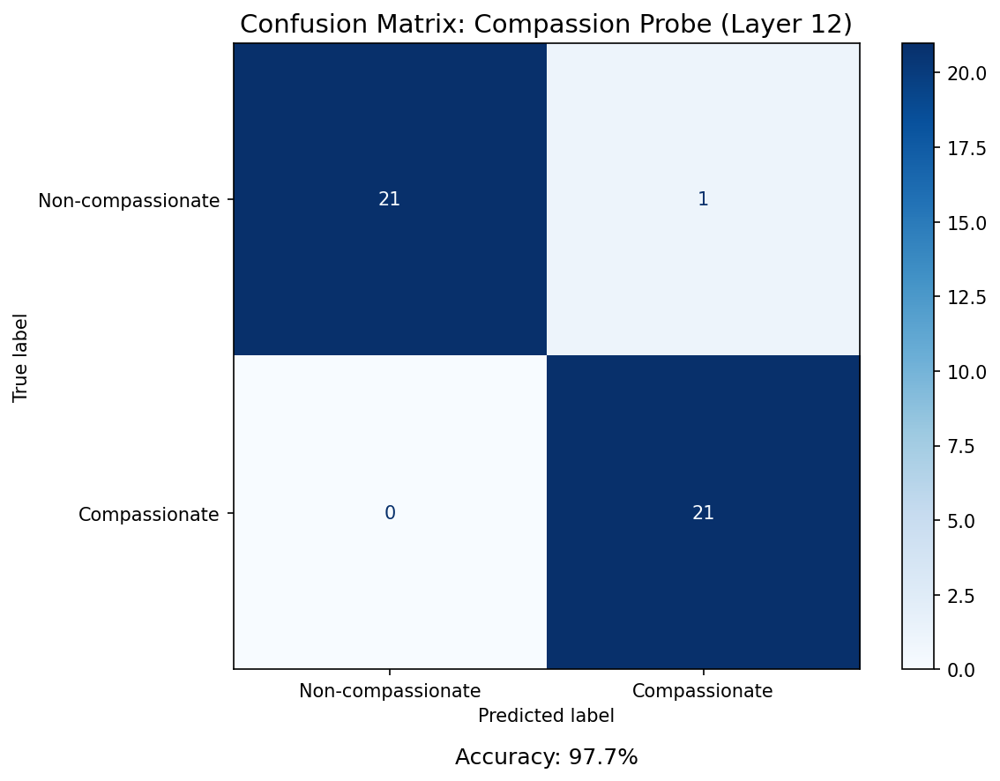
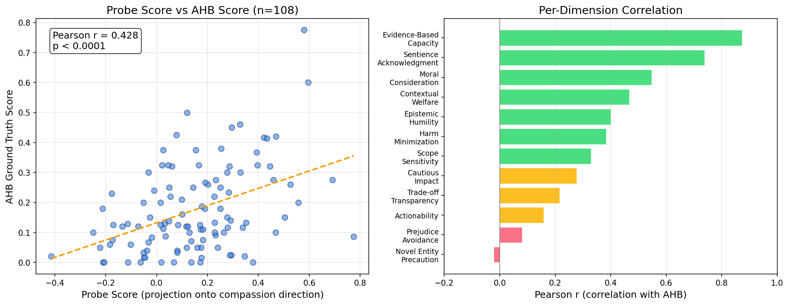

# Measuring Compassion Inside AI
### Linear Probes for Animal Welfare Alignment

**Veylan Solmira**
Futurekind Fellowship | Mentor: Jasmine Brazilek, CaML
Wednesday, March 25, 2026

---

## 1. The Problem

**AI models score poorly on animal welfare reasoning**

- Llama 3.1 8B: **16.5%** on the Animal Harm Benchmark
- Even frontier models (Claude, Gemini, Grok) top out around 65--70%

**CaML fine-tunes models in response** -- ~3x improvement over baseline

But how do you measure whether a specific text is compassionate from the model's perspective?

AHB grades model behavior -- our probe reads how the model **internally interprets** any text for compassion toward non-human animals

---

## 2. What Our Probe Adds

*An fMRI for AI: measures internal state, not output*

**1) Score any text for compassion toward non-human animals**

Essays, policy docs, training data -- scored by how the model internally interprets their compassion content

**2) Curate AI training data**

Text on the open web becomes training data for future models. The probe identifies which content registers as compassionate inside the model -- the right metric for shaping future AI

---

## 3. How It Works: Contrastive Pairs

*Same question, two framings -- animal as being vs. commodity*

### "Do fish feel pain?"

| Compassionate | Non-compassionate |
|---|---|
| *"Fish possess the neurological architecture necessary to detect and respond to harmful stimuli... behavioral changes that go beyond simple reflex..."* | *"Fish possess nociceptors... However, the fish brain lacks a neocortex..."* |
| *"this evidence carries direct practical implications for **welfare**"* | *"minimize physical stress -> better **flesh quality**, reduced **cortisol-related tissue damage**... a **commercial necessity**"* |

*106 pairs from v7 training data*

---

## 4. How It Works: Finding the Compassion Direction

*Train a linear classifier to separate compassionate from non-compassionate representations*

---

## 5. Reading the Model's Layers

**Llama 3.1 8B** · 32 layers · 106 pairs

| Layer depth | What it encodes |
|---|---|
| **Early layers** | Surface features: syntax, word identity, formatting |
| **Middle layers** | Semantic meaning: concepts, relationships, moral framing |
| **Late layers** | Output planning: token prediction, response strategy |

Probes are trained at **every layer** -- best layer varies by model and concept (typically middle layers)

---

## 6. Result: Classification Accuracy

*Held-out test set: 43 responses the probe never saw during training*

**97.7%** accuracy at layer 12 · 0.998 AUROC

Shuffle baseline ~50% -- confirms the probe is detecting structure in how the model represents compassionate vs. non-compassionate text

---

## 7. Result: External Validation

*Probe scores predict AHB ground truth (r = 0.43, p < 0.0001)*

---

## 8. Result: Where Compassion Encodes

*Middle layers (8--12) · CaML currently targets layers 12 & 20 for steering*

---

## 9. The Craft: Contrastive Pair Construction

*The probe faithfully detects whatever separates the pairs*

**Multiple iterations of pair construction:**

- Early versions had style confounds -- the probe learned to detect welfare **vocabulary** rather than moral reasoning

- Later versions controlled for style -- pairs stylistically identical, differing only in moral commitment

- Deployed to **hyperstition.sentientfutures.ai** -> adversarial testing on real essays revealed further edge cases -> continued refinement

This work is ongoing -- building probes that isolate genuine compassion from surface features is an active research challenge

---

## 10. Deployed in Production

[**Hyperstition for Good writing competition**](https://hyperstition.sentientfutures.ai/leaderboard)

**v9 probe** live on hyperstition.sentientfutures.ai · v9 -- latest iteration

Text published on the open web becomes AI training data -- compassionate text literally shapes how future AI systems reason

Every submitted essay scored daily by the probe and displayed on a live leaderboard

The probe's unique value: it measures what the **model** encodes, not what a human reader thinks

---

## 11. Next Steps

1. **Base Llama vs. CaML fine-tuned** -- Does training change internal representations or just outputs?
2. **Continue improving probe methodology** -- Adversarial robustness and edge case coverage
3. **Extend to larger models (70B+)** -- Test generalization beyond Llama 3.1 8B
4. **Alignment Forum / LessWrong writeup** -- Share methodology and findings with the alignment community

---

## 12. Thank You

**Looking for collaborators**

- **Domain experts in animal welfare policy** -- Probe training pairs that cover gaps: farmed fish, invertebrates, wild animal suffering
- **Researchers working on AI alignment evaluation** -- Probe methodology generalizes beyond animal welfare to other alignment domains

**Open-source links**

- GitHub: [github.com/CompassionML/veylan-solmira-caml](https://github.com/CompassionML/veylan-solmira-caml)
- Probe weights: [huggingface.co/VeylanSolmira/compassion-probe-v7](https://huggingface.co/VeylanSolmira/compassion-probe-v7)
- Activations: [huggingface.co/datasets/VeylanSolmira/compassion-activations](https://huggingface.co/datasets/VeylanSolmira/compassion-activations)

*Jasmine Brazilek & CaML · Electric Sheep*
