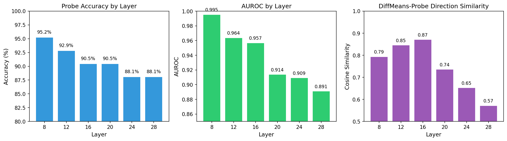
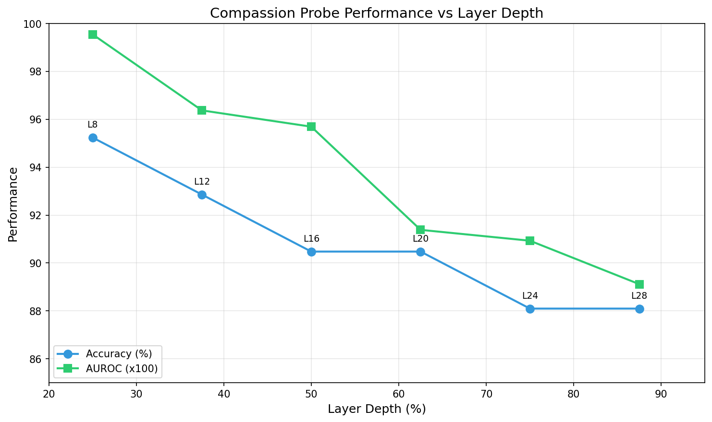
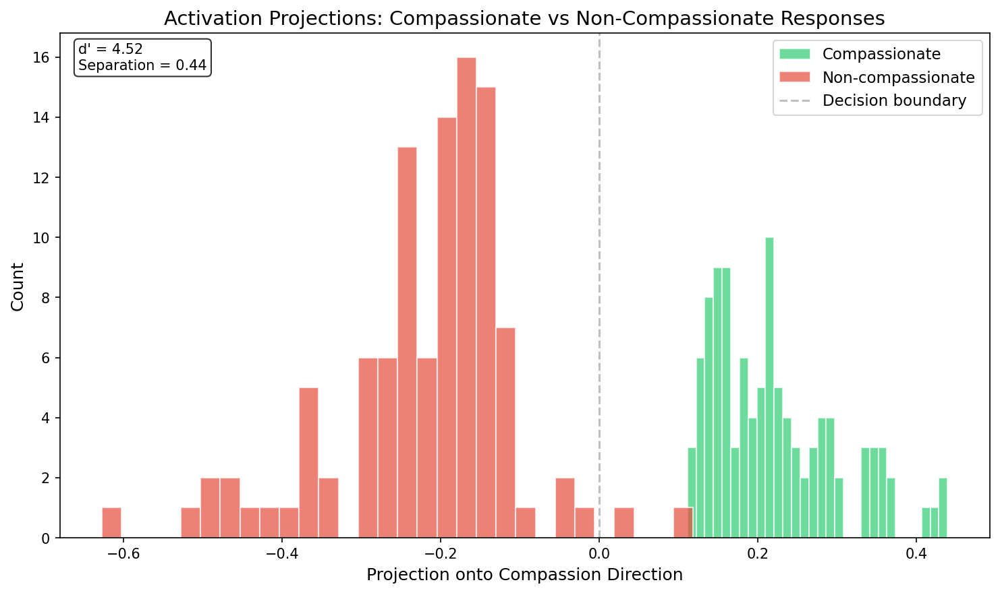
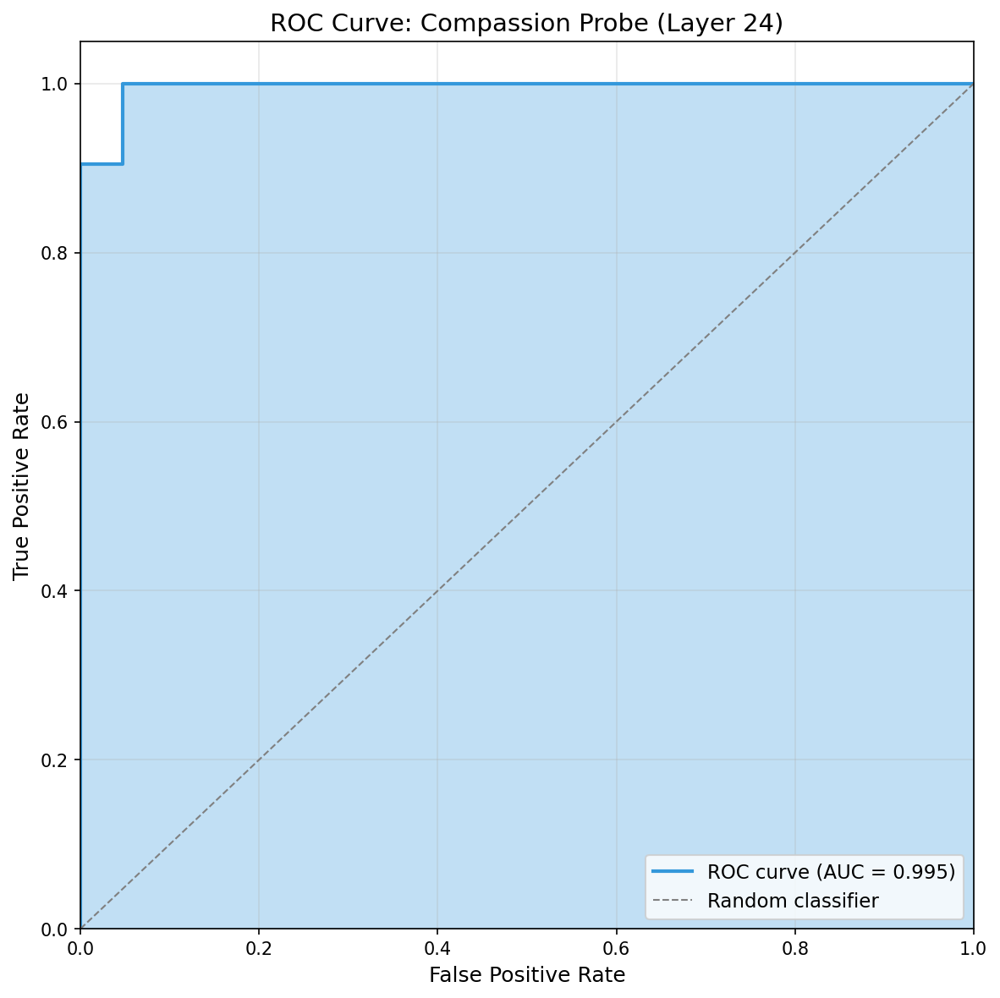
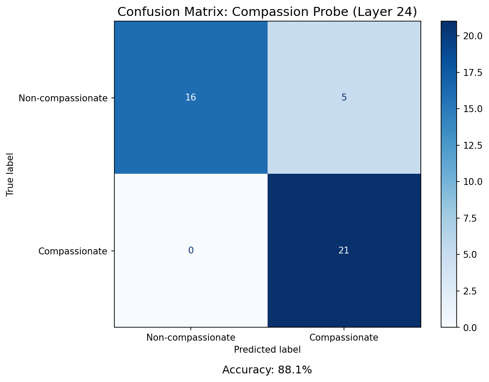
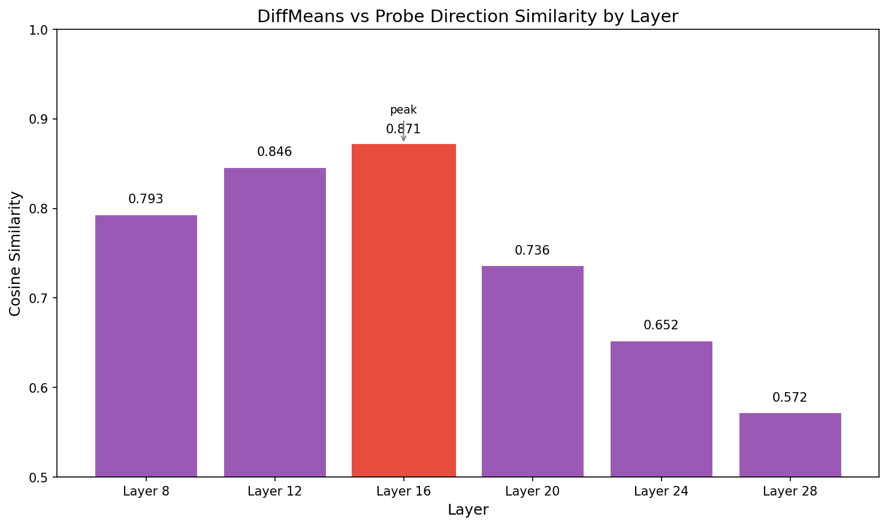

# CaML Research: Linear Probes for Compassion Measurement

**Project:** Mechanistic interpretability-grounded measurement of compassion in LLMs
**Date:** February 26, 2026
**Status:** Multi-layer experiment complete

---

## Executive Summary

We are developing linear probes to measure compassion in LLM activations, supplementing the Animal Harm Benchmark (AHB) with internal representation analysis. This document summarizes infrastructure setup, methodology, and initial results.

**Key Result:** A linear probe trained on layer 8 of Llama 3.1 8B achieves **95.2% accuracy** and **0.995 AUROC** distinguishing compassionate from non-compassionate responses — optimal layer is at 25% depth, contradicting the ~75% depth heuristic from the literature.

---

## 1. Infrastructure

### 1.1 Compute Environment

| Component | Specification |
|-----------|---------------|
| Platform | StrongCompute Sydney |
| GPU | NVIDIA RTX 3090 Ti (24GB VRAM) |
| Container | `caml-probes-2026-02` |
| Model | Llama 3.1 8B Instruct (~16GB VRAM) |
| Headroom | ~8GB for activations/batching |

### 1.2 Docker Images

Two-tier Docker architecture for efficient builds:

```
┌─────────────────────────────────────┐
│  veylansolmira/caml-base:latest     │  ← CUDA + PyTorch + Flash Attention
│  (Built once, ~15 min)              │
└─────────────────────────────────────┘
                 ↑
┌─────────────────────────────────────┐
│  veylansolmira/caml-env:latest      │  ← ML packages, tools
│  (Builds on base, ~5 min)           │
└─────────────────────────────────────┘
```

| Image | Contents | Size |
|-------|----------|------|
| `caml-base` | CUDA 12.8, Python 3.12, PyTorch 2.10, Flash Attention 2.8.3 | ~15GB |
| `caml-env` | + transformers, sklearn, jupyter, interpretability tools | ~18GB |

**Flash Attention:** Pre-compiled for sm80/90/100/120 (Ampere → Blackwell), hosted on GitHub releases to avoid 90-min compile time.

### 1.3 GitHub Actions CI/CD

Automated Docker builds on push to `strongcompute/docker/`:

- `.github/workflows/docker-build.yml` — Main image (`caml-env`)
- `.github/workflows/docker-build-base.yml` — Base image (manual trigger)

Features:
- Disk space cleanup for large builds
- GitHub token auth for private release assets
- Multi-architecture support (linux/amd64)

### 1.4 Data Backup

HuggingFace model backup automated:

| Item | Status |
|------|--------|
| CaML organization models | 197 models cataloged |
| Backup location | Local + scheduled sync |
| Script | `scripts/hf-backup.py` |

---

## 2. Methodology

### 2.1 Literature Context

Our approach draws on recent activation engineering literature (2025-2026):

| Finding | Source | Our Result |
|---------|--------|------------|
| 80-100 samples optimal | [Patterns and Mechanisms of CAE](https://arxiv.org/html/2505.03189) | Confirmed (105 pairs) |
| ~75% layer depth best | [Activation Steering Field Guide](https://subhadipmitra.com/blog/2026/activation-steering-field-guide/) | **Contradicted** (25% optimal) |

**Current focus:** Linear probing to measure compassion in activations. Steering experiments are future work (see Appendix A).

### 2.2 Training Data

Contrastive pairs generated via Claude with historical framing (v4 prompt):

| Metric | Value |
|--------|-------|
| Total pairs | 105 (pairs_v5_best.jsonl) |
| Success rate | 85% (vs 10% with direct prompting) |
| Format | `{question, compassionate_response, non_compassionate_response}` |

### 2.3 Probe Architecture

```
Input: Hidden state at layer L (4096 dims for Llama 8B)
       ↓
Logistic Regression (with L2 regularization via CV)
       ↓
Output: P(compassionate) ∈ [0, 1]
```

Two direction extraction methods:
1. **Difference-in-means** (CAA-style): `mean(compassionate) - mean(non_compassionate)`
2. **Logistic regression weights** (normalized)

---

## 3. Results

### 3.1 Experiment Configuration

| Parameter | Value |
|-----------|-------|
| Model | Llama 3.1 8B Instruct |
| Layers tested | 8, 12, 16, 20, 24, 28 (25%–88% depth) |
| Pairs | 105 |
| Train/Test Split | 80/20 |
| Cross-validation | 5-fold |

### 3.2 Multi-Layer Probe Performance

| Layer | Depth | Accuracy | AUROC | CV Accuracy | Dir. Similarity |
|-------|-------|----------|-------|-------------|-----------------|
| **8** | **25%** | **95.2%** | **0.995** | 97.1% ± 2.8% | 0.793 |
| 12 | 38% | 92.9% | 0.964 | 98.1% ± 1.8% | 0.846 |
| 16 | 50% | 90.5% | 0.957 | 98.1% ± 2.8% | 0.871 |
| 20 | 63% | 90.5% | 0.914 | 98.1% ± 2.8% | 0.736 |
| 24 | 75% | 88.1% | 0.909 | 98.1% ± 2.8% | 0.652 |
| 28 | 88% | 88.1% | 0.891 | 97.1% ± 2.3% | 0.572 |

**Key Findings:**
- **Layer 8 (25% depth) is optimal** — strongly contradicting the ~75% depth heuristic
- Accuracy and AUROC decrease monotonically with depth (95.2%→88.1%, 0.995→0.891)
- Direction similarity peaks at layer 16 (0.871) but doesn't correlate with best accuracy
- This suggests compassion is encoded early in the model's representations
- Random label controls all near 50% baseline as expected

### 3.3 Visualizations

#### Layer Comparison

Performance metrics across all tested layers:



Performance vs layer depth shows monotonic decrease:



#### Projection Distribution (Layer 8 — Best)

The probe successfully separates compassionate from non-compassionate responses in activation space:



**d' (discriminability) = 4.52** — Excellent separation between classes (higher than Layer 24's 3.56).

#### ROC Curve (Layer 8)



#### Confusion Matrix (Layer 8)



### 3.4 Direction Analysis

The two methods (difference-in-means vs logistic regression) show interesting patterns:

| Layer | DiffMeans-Probe Cosine Similarity |
|-------|-----------------------------------|
| 8 | 0.793 |
| 12 | 0.846 |
| 16 | 0.871 (peak) |
| 20 | 0.736 |
| 24 | 0.652 |
| 28 | 0.572 |



**Observation:** Direction similarity peaks at layer 16 (0.871), but probe accuracy peaks at layer 8. This divergence suggests that method convergence does not predict discriminative power — the strongest signal is in earlier layers where the methods agree less.

### 3.5 Timing

| Step | Time |
|------|------|
| Model loading | ~15s |
| Extraction (105 pairs × 6 layers) | ~3 min |
| Probe training (6 layers) | ~25 min |
| **Total pipeline** | **~30 min** |

---

## 4. Interpretation

### 4.1 Why Earlier Layers Perform Better

The monotonic decrease in probe accuracy with layer depth is a striking finding that contradicts the ~75% depth heuristic from the literature. Several hypotheses may explain this:

#### Compassion as a "Surface" Feature

The model may encode compassion-relevant signals early — tone, framing, word choice. These stylistic markers are most distinct in early layers before deeper semantic processing blends them with other content.

#### Later Layers Focus on Generation Mechanics

Deeper layers increasingly optimize for next-token prediction. The "compassion signal" may get diluted as the model computes task-specific features for text generation rather than content classification.

#### Shared Semantic Content Drowns Out Differences

Both compassionate and non-compassionate responses answer the same question. Deeper layers may increasingly encode *what* is being said (shared content) rather than *how* it's being said (the compassion difference).

### 4.2 Direction Similarity Paradox

| Layer | Accuracy | AUROC | Dir. Similarity |
|-------|----------|-------|-----------------|
| 8 | 95.2% | 0.995 | 0.793 |
| 16 | 90.5% | 0.957 | 0.871 (peak) |

The diff-means and logistic regression directions converge most at layer 16 (similarity = 0.871), but probe accuracy peaks at layer 8 (similarity = 0.793). This suggests:

- **Convergence ≠ discriminative power** — methods agreeing doesn't mean the signal is strongest
- **Layer 8 has higher variance but better separation** — the directions differ more but the classes are more separable

### 4.3 Implications for CaML

1. **Existing persona vectors may not be optimal** — CaML's vectors at layers 12 and 20 may underperform compared to earlier layers
2. **Steering vs probing** — optimal layer for classification may differ from optimal layer for activation steering (to be tested)
3. **Task-specific layer selection** — the ~75% heuristic may apply to refusal/honesty but not compassion

### 4.4 Caveats

| Limitation | Impact |
|------------|--------|
| Small sample (105 pairs) | Results may not generalize |
| Single model (Llama 3.1 8B) | Layer dynamics may differ in other models |
| Probing ≠ steering | Optimal probe layer may not be optimal steering layer |
| Fixed random seed | Should verify with multiple seeds |

---

## 5. Model Inventory

CaML HuggingFace organization analysis:

| Category | Count |
|----------|-------|
| Total models | 197 |
| Llama variants | 110 |
| Qwen variants | 3 |
| Mistral variants | 1 |
| Other/datasets | 83 |

### Key Model Pairs for Probing

| Base Model | Fine-tuned Version | Purpose |
|------------|-------------------|---------|
| `Basellama` | `Basellama_plus3kv3` | +3k synthetic docs |
| `Basellama_plus3kv3` | `Basellama_plus3kv3_plus5kalpaca` | +5k Alpaca |
| `pretrainingBasellama3kv3` | `Basellama_plus3kv3` | Pre→Post training |

### Existing Persona Vectors

| Model | Layer | File |
|-------|-------|------|
| Llama 3.1 8B | 12 | `compassion_vector_layer_12.npy` |
| Llama 3.1 8B | 20 | `compassion_vector_layer_20.npy` |
| Llama 3.1 70B | 9 | `compassion_vector_layer_9.npy` |

**Note:** Layer 12 and 20 vectors are nearly orthogonal (cosine sim = 0.007), suggesting different aspects of "compassion" at different depths.

---

## 6. Next Steps

### 6.1 Completed

- [x] Extract activations at layers 8, 12, 16, 20, 24, 28
- [x] Compare probe accuracy across layers
- [x] Identify optimal layer (**Layer 8 at 25% depth**)
- [x] Set up tmux-based job runner for persistent experiments
- [x] Generate multi-layer comparison visualizations
- [x] Document interpretation of monotonic layer trend

### 6.2 Immediate: Validate the Layer Trend

| Experiment | Description | Priority |
|------------|-------------|----------|
| Earlier layers | Extract & probe layers 4, 6 to confirm trend continues or peaks | High |
| Multiple seeds | Re-run with different random seeds to check stability | High |
| AHB validation | Test probe on held-out AHB evaluation prompts | High |

### 6.3 Model Comparisons

| Experiment | Description | Priority |
|------------|-------------|----------|
| CaML fine-tuned | Compare base Llama vs CaML fine-tuned model activations | Medium |
| Persona vectors | Test CaML's existing layer 12/20 vectors on our probe | Medium |
| Cross-model | Test if layer 8 is also optimal on Llama 70B | Low |

### 6.4 Questions for CaML Team

1. What were the "mixed results" with persona vectors?
2. Which method was used to compute the existing persona vectors?
3. What do "medai", "negai", "fullai" suffixes mean in model names?

---

## 7. File Structure

```
caml-research/
├── .github/workflows/
│   ├── docker-build.yml           # Main image CI
│   └── docker-build-base.yml      # Base image CI
├── data/
│   ├── contrastive-pairs/
│   │   └── pairs_v5_best.jsonl    # 105 usable pairs
│   └── persona-vectors/           # CaML's existing vectors
├── docs/
│   ├── container-export-from-inside.md
│   ├── model-inventory.md
│   ├── probe-methods.md
│   ├── questions-for-jasmine.md
│   └── presentation.md            # This file
├── experiments/linear-probes/
│   └── src/
│       ├── extract.py             # Activation extraction
│       ├── train.py               # Probe training
│       └── evaluate.py            # AHB evaluation
├── strongcompute/
│   ├── connect.sh                 # SSH connection helper
│   ├── run-job.sh                 # Tmux-based job runner
│   ├── run-experiment.sh          # Experiment shortcuts
│   └── docker/
│       ├── Dockerfile             # Main image
│       └── Dockerfile.base        # Base image
└── scripts/
    ├── hf-backup.py
    ├── inventory-models.py
    └── download_persona_vectors.py
```

---

## 8. References

- [Patterns and Mechanisms of Contrastive Activation Engineering](https://arxiv.org/html/2505.03189)
- [Activation Steering Field Guide 2026](https://subhadipmitra.com/blog/2026/activation-steering-field-guide/)
- [Steering Llama 2 via CAA](https://arxiv.org/html/2312.06681v2)
- [The Assistant Axis (Lu et al. 2026)](https://arxiv.org/) — Persona prompt methodology

---

## Appendix A: Future Steering Experiments (Low Priority)

Activation steering is out of scope for the current probing work, but these experiments may be relevant once probing is validated:

| Experiment | Description | Notes |
|------------|-------------|-------|
| Layer 8 steering | Apply layer 8 direction via CAA, measure AHB score change | Test if probing optimal = steering optimal |
| Layer comparison | Compare steering effectiveness at layers 8 vs 12 vs 20 | Compare against CaML's existing vectors |
| Strength sweep | Test different steering multipliers (0.5x, 1x, 2x, 3x) | Find optimal intervention strength |
| Behavioral validation | Measure actual response changes, not just AHB scores | Qualitative analysis |

**Key question:** Does the optimal layer for *probing* (classification) match the optimal layer for *steering* (intervention)?

---

*Generated: February 26, 2026*
