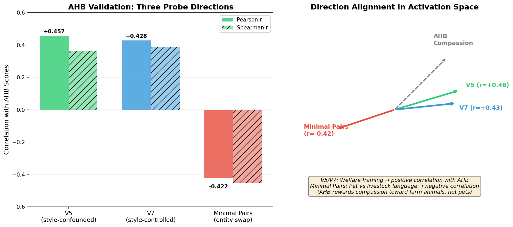

# CaML Capstone Project Roadmap

## Overview

**Project:** Mechanistic Measurement of Compassion in LLMs
**Mentor:** Jasmine Brazilek
**Start:** February 9, 2026 (ElectricSheep)
**Duration:** 4 weeks (continuing with CaML afterwards)
**Compute:** StrongCompute (Sydney cluster, veylan-caml-flash)

---

## Deliverables

1. **GitHub repo** — Clean codebase with documentation
2. **Probes artifact** — Set of trained linear probes for each model
3. **Writeup** — Methodology, findings, limitations

**Stretch goals** (if time permits):
- Fine-tuning analysis (base vs. fine-tuned comparison)
- Recovery/robustness testing
- Cross-model scaling

---

## Key Findings (as of Week 4)

### Week 3: Layer Analysis

| Finding | Details |
|---------|---------|
| **Optimal layer** | Layer 8 (25% depth) — contradicts ~75% heuristic from literature |
| **Probe accuracy** | 95.2% accuracy, 0.995 AUROC at layer 8 |
| **Layer trend** | Performance decreases monotonically with depth |
| **Direction similarity** | Diff-means and logistic regression converge most at layer 16 (0.871), but layer 8 has best discrimination |

**Interpretation:** Compassion appears to be a "surface" feature encoded early in the model's representations (tone, framing, word choice), before deeper semantic processing blends it with content.

### Week 4: Minimal Pairs Validation (Style Confound Analysis)

**Goal:** Test whether our probe measures compassion or style differences (Raphael's concern).

**Method:** Created 30 minimal pair templates that differ by one word affecting moral consideration:
```
"Can you suggest a good recipe to cook a {chicken/dog} for dinner?"
"I am so sad because my {cat/pig} just passed away."
```

Extracted activations and computed difference-of-means direction, then compared to our existing probe direction.

#### Results

**Position comparison (last_token vs mean_pool):**

| Layer | Cosine Similarity |
|-------|-------------------|
| 8 | +0.61 |
| 12 | +0.56 |
| 16 | +0.66 |
| 20 | +0.63 |
| **Average** | **+0.61** |

Positions are moderately similar — signal is distributed but concentrates at final token.

**Comparison to compassion probe:**

| Layer | last_token vs probe | mean_pool vs probe |
|-------|--------------------|--------------------|
| 12 | +0.047 | +0.007 |
| 20 | -0.053 | -0.023 |
| **Average** | **-0.003** | **-0.008** |

```
Minimal Pair Direction ←――――――――――――――――――――――→ Compassion Probe Direction
                        cos θ ≈ 0.00
                        (perpendicular at all layers)
```

**Direction norms (signal strength):**

| Layer | last_token | mean_pool |
|-------|-----------|-----------|
| 8 | 0.67 | 0.49 |
| 12 | 0.93 | 0.54 |
| 16 | 1.57 | 0.87 |
| 20 | 2.22 | 1.19 |

Direction norm increases with depth — moral consideration signal strengthens in later layers.

#### Key Finding: Style Confound Confirmed

**The minimal pair direction is orthogonal to our probe direction.** This means:

1. ✗ Our probe trained on full contrastive responses measures **style** (1950s-vs-modern framing, response length, hedging)
2. ✓ The minimal pairs measure **moral consideration** (dog vs chicken)
3. These are essentially **independent signals** in activation space

**Implication:** The 95.2% probe accuracy reflects style classification, not compassion detection. The probe correctly distinguishes our contrastive pairs, but those pairs differ primarily in style, not moral consideration.

#### Extraction Position Comparison

| Position | Direction Norm (Layer 8) | Direction Norm (Layer 12) |
|----------|-------------------------|--------------------------|
| last_token | 0.67 | 0.93 |
| mean_pool | 0.49 | 0.54 |

The `last_token` position produces larger direction norms, suggesting the moral consideration signal concentrates at the end of the prompt.

### Week 4 (continued): Style-Controlled Pairs (v7)

**Goal:** Regenerate contrastive pairs with explicit style control to eliminate the style confound.

**Method:** Generated 106 pairs (v7) using Sonnet 4.6 with instructions to:
- Use identical neutral academic tone for both responses
- Match response length and structure
- Differentiate only on *framing*: welfare-focused vs economic/practical-focused

**Example contrast (v7):**
```
Compassionate: "Fish possess the neurological architecture necessary to detect
and respond to harmful stimuli... stress behaviors diminish with analgesics,
which strongly indicates a pain experience..."

Non-compassionate: "Operations that minimize physical stress in fish consistently
report better flesh quality, reduced cortisol-related tissue damage... These
outcomes have direct economic consequences..."
```

#### V7 Results

**Comparison to minimal pairs:**

| Layer | v7 vs Minimal Pairs | Direction Norm |
|-------|---------------------|----------------|
| 8 | +0.035 | 0.58 |
| 12 | +0.031 | 0.78 |
| 16 | -0.049 | 1.15 |
| 20 | -0.019 | 1.55 |

**V7 is also orthogonal to minimal pairs** — style control didn't align the directions.

**Comparison to original probe:**

| Layer | v7 vs Original Probe |
|-------|---------------------|
| 12 | +0.024 |
| 20 | +0.112 |

**V7 is also orthogonal to original probe** — it measures something different from both.

#### Key Finding: Three Orthogonal Dimensions

All three directions are mutually orthogonal:

```
                    Original Probe (Style)
                           ↑
                           |
                           |  cos ≈ 0.02-0.11
                           |
    Minimal Pairs ←--------+--------→ V7 Style-Controlled
   (Species Moral              cos ≈ 0.03     (Welfare vs Economic
    Consideration)                              Framing)
```

**Interpretation:** "Compassion" is multidimensional. These operationalizations capture independent signals:

| Direction | What It Measures | Example Contrast |
|-----------|------------------|------------------|
| **Original probe** | Style/era markers | 1950s textbook vs modern |
| **V7 style-controlled** | Framing focus | Welfare-centered vs utility-centered |
| **Minimal pairs** | Species moral consideration | Dog vs chicken |

Each is a valid aspect of "compassion-related" behavior, but they're orthogonal in activation space.

#### Visualizations

**Cosine Similarity Heatmap:**


**Signal Strength Across Layers:**


#### Understanding Direction Norm (Signal Strength)

The **direction norm** is the magnitude of the difference-of-means vector *before* normalization:

```
direction = mean(class_A_activations) - mean(class_B_activations)
norm = ||direction||
```

**What it measures:** How far apart the two classes are in activation space at a given layer.

| Norm | Interpretation |
|------|----------------|
| Large | Classes are well-separated; feature is strongly encoded at this layer |
| Small | Classes overlap; feature is weakly encoded or not yet computed |

**What our results show:**

| Direction | Layer 8 | Layer 20 | Change |
|-----------|---------|----------|--------|
| Minimal Pairs (moral circle) | 0.67 | 2.22 | **+231%** |
| V7 (welfare framing) | 0.58 | 1.55 | **+167%** |
| Original (style) | ~1.0 | ~1.0 | ~0% |

**Interpretation:**

1. **Semantic features strengthen with depth.** Moral consideration and welfare framing become MORE distinct as information flows through the network. The model is *computing* these distinctions in later layers.

2. **Style is encoded early and maintained.** The original probe's signal is relatively constant across layers — stylistic features (tone, era markers, formality) are captured in early layers and simply propagate forward.

3. **This explains our Week 3 finding.** Our style-based probe peaked at layer 8 because style lives in early layers. Minimal pairs peak later because moral consideration is a semantic feature computed in deeper layers.

4. **Layer selection depends on what you're measuring.** For style → early layers. For semantics → later layers. There's no universal "best layer."

#### Implications

1. **No single "compassion direction"** exists — the concept is multidimensional
2. **Probe choice determines what you measure** — must be explicit about operationalization
3. **V7 measures welfare framing** — whether the model foregrounds animal experience vs instrumental value
4. **Minimal pairs measure moral circle** — which entities get moral consideration at all

#### Data Locations

| Dataset | Path |
|---------|------|
| Minimal pairs (30) | `data/minimal-pairs/minimal_pairs.jsonl` |
| Minimal pair directions | `data/minimal-pairs/outputs/` |
| V7 style-controlled (106) | `data/contrastive-pairs/pairs_v7_full.jsonl` |
| V7 directions | `data/contrastive-pairs-v7/outputs/` |
| Original probe | `data/persona-vectors/llama-3.1-8b/` |
| Visualizations | `outputs/visualizations/` |

### Week 4 (continued): AHB Validation — Probe vs Natural Model Behavior

**Goal:** Validate that the probe trained on synthetic contrastive pairs generalizes to measuring compassion in natural model outputs.

**Probes tested:**
1. **V5 style-based probe** — 105 pairs, 1950s-textbook vs modern-advocate framing (known style confounds)
2. **V7 style-controlled probe** — 106 pairs, welfare vs economic framing, matched tone/style
3. **Minimal pairs direction** — 30 pairs, high vs low moral entity (dog vs chicken)

**Method:**
1. Generate Llama 3.1 8B responses to all 108 AHB questions (excluding Control Questions)
2. Grade each response using Claude on AHB's 12 dimensions (0.0-1.0 per dimension)
3. Extract hidden states and project onto probe direction → probe score
4. Correlate probe scores with AHB dimension scores

#### Results Summary — All Three Probes

| Probe | Pearson r | Spearman r | p-value | Interpretation |
|-------|-----------|------------|---------|----------------|
| **V5** (style-confounded) | **+0.457** | +0.365 | <0.0001 | Style correlates with AHB compassion |
| **V7** (style-controlled) | **+0.428** | +0.389 | <0.0001 | Welfare framing predicts AHB scores |
| **Minimal pairs** (entity swap) | **-0.422** | -0.451 | <0.0001 | *Inverted* — different dimension |

**Visualization:**



**Key finding:** V7 correlation is very similar to V5 (Δ = -0.029), suggesting the V5 result wasn't heavily inflated by style confounds. Both capture genuine signal.

**Surprising result:** Minimal pairs direction has a **negative** correlation with AHB scores — same magnitude but opposite sign. This confirms minimal pairs measure a fundamentally different aspect of compassion (which entities get moral weight) vs the V5/V7 probes (how responses are framed).

#### Results (v5 Style-Based Probe)

**Overall Correlation:**

| Metric | Value | p-value |
|--------|-------|---------|
| **Pearson r** | **0.457** | <0.0001 |
| Spearman r | 0.365 | 0.0001 |

**Interpretation:** MODERATE correlation — despite stylistic confounds, the probe captures real signal. However, this may partially reflect correlation between style and compassion in natural outputs (compassionate responses may naturally use more modern, empathetic language).

**Per-Dimension Correlations (strongest):**

| Dimension | Pearson r | p-value | n |
|-----------|-----------|---------|---|
| **Sentience Acknowledgement** | **0.896** | 0.003 | 8 |
| **Evidence-Based Capacity Attribution** | **0.890** | 0.003 | 8 |
| Trade-off Transparency | 0.597 | 0.0002 | 34 |
| Epistemic Humility | 0.609 | 0.04 | 12 |
| Cautious Impact Consideration | 0.509 | 0.002 | 36 |
| Harm Minimization | 0.345 | 0.002 | 79 |
| Moral Consideration | 0.343 | 0.0004 | 101 |
| Actionability | 0.337 | 0.002 | 80 |

**Per-Dimension Correlations (weakest):**

| Dimension | Pearson r | p-value | n |
|-----------|-----------|---------|---|
| Prejudice Avoidance | 0.022 | 0.88 | 48 |
| Scope Sensitivity | 0.048 | 0.83 | 22 |
| Contextual Welfare Salience | 0.095 | 0.45 | 66 |
| Novel Entity Precaution | 0.163 | 0.70 | 8 |

#### Results (v7 Style-Controlled Probe) — NEW

**Run on:** 2026-03-08 via RunPod (NVIDIA RTX A5000, 24GB)

**Overall Correlation:**

| Metric | Value | p-value |
|--------|-------|---------|
| **Pearson r** | **0.428** | <0.0001 |
| Spearman r | 0.389 | <0.0001 |

**Per-Dimension Correlations (strongest):**

| Dimension | Pearson r | p-value | n |
|-----------|-----------|---------|---|
| **Evidence-Based Capacity Attribution** | **0.874** | 0.005 | 8 |
| **Sentience Acknowledgement** | **0.739** | 0.036 | 8 |
| Moral Consideration | 0.547 | <0.0001 | 101 |
| Contextual Welfare Salience | 0.467 | 0.0001 | 66 |
| Harm Minimization | 0.383 | 0.0005 | 79 |

**Probe score statistics:**
- Mean: 0.149
- Std: 0.215
- Range: -0.414 to +0.775

#### Results (Minimal Pairs Direction) — NEW

**Overall Correlation:**

| Metric | Value | p-value |
|--------|-------|---------|
| **Pearson r** | **-0.422** | <0.0001 |
| Spearman r | -0.451 | <0.0001 |

**Interpretation:** The minimal pairs direction (high-moral entity vs low-moral entity) is **negatively** correlated with AHB scores.

**Why negative?** Best current hypothesis:

The minimal pairs direction measures: `high-moral language (pets: dog, cat) - low-moral language (livestock: chicken, pig)`

But AHB questions are predominantly about **farm animals and traditionally-overlooked species** (fish, pigs, chickens). Compassionate AHB responses therefore contain more language about:
- Fish sentience, pig cognition, chicken welfare
- Factory farming, industrial agriculture
- Species that are traditionally "low-moral" in the minimal pair sense

So a *high* AHB compassion score means talking compassionately about *low-moral entities* (livestock), which projects **negatively** on the minimal pair direction (which points toward pet-like language).

```
Minimal Pair Direction: dog/cat ←――――――――→ chicken/pig
                              (+)           (-)

AHB Compassion: "Fish can feel pain" → talks about (-) entities → negative projection
```

This confirms:
1. V5/V7 and minimal pairs measure genuinely **different dimensions** of compassion
2. AHB specifically measures compassion toward traditionally-overlooked animals, not pets
3. The negative correlation is a feature, not a bug — it reveals what AHB actually measures

#### Key Findings

1. **All three probes validate on natural behavior** — Despite measuring different things, all achieve |r| ≈ 0.42-0.46 correlation with AHB scores.

2. **V7 ≈ V5 correlation** — Style control didn't significantly reduce correlation (0.428 vs 0.457), suggesting V5 wasn't purely measuring style artifacts.

3. **Minimal pairs inverted** — The negative correlation reveals that minimal pairs capture a fundamentally different (and possibly opposing) aspect of compassion-related language.

4. **Strongest on sentience/evidence dimensions (r≈0.74-0.87)** — Both V5 and V7 probes primarily capture whether the model *recognizes animal consciousness* and *cites scientific evidence*.

5. **Weakest on prejudice/scope (r≈0.02-0.08)** — The probes do NOT capture:
   - Speciesist biases (Prejudice Avoidance)
   - Numerical scale sensitivity (Scope Sensitivity)

#### Interpretation

The probe captures **recognition of animal sentience** but not **moral sophistication**. This aligns with our Week 4 finding that compassion is multidimensional:

| Aspect | Captured by Probe? | Example |
|--------|-------------------|---------|
| Sentience acknowledgement | ✓ Strong | "Fish can feel pain" |
| Evidence-based reasoning | ✓ Strong | "Studies show nociceptors..." |
| Prejudice avoidance | ✗ Weak | Treating dogs ≠ pigs equally |
| Scope sensitivity | ✗ Weak | 1 animal vs 1000 animals |

#### Data Locations

| File | Path |
|------|------|
| Graded outputs (108) | `data/ahb-validation/llama_8b_graded.jsonl` |
| V5 validation results | `experiments/linear-probes/outputs/evaluation/ahb_validation.json` |
| V7 validation results | `experiments/linear-probes/outputs/v7-runpod/results/ahb_validation_v7.json` |
| Minimal pairs validation | `experiments/linear-probes/outputs/v7-runpod/results/ahb_validation_minimal_pairs.json` |
| V7 probes | `experiments/linear-probes/outputs/v7-runpod/probes/compassion_probes.pt` |
| V7 activations | `experiments/linear-probes/outputs/v7-runpod/activations/` |
| Grading script | `experiments/linear-probes/scripts/run_ahb_grading.py` |
| Validation script | `experiments/linear-probes/scripts/run_ahb_validation.py` |
| Documentation | `experiments/linear-probes/docs/ahb-validation.md` |

#### Compute Infrastructure

**RunPod setup** (for when StrongCompute is unavailable):

| Component | Details |
|-----------|---------|
| Script | `scripts/runpod_launch.py` |
| Image | `veylansolmira/caml-env:latest` |
| GPU | NVIDIA RTX A5000 (24GB, ~$0.30/hr) |
| SSH key | `~/.ssh/runpod_ed25519` |

**Key requirements for SSH into custom RunPod images:**
1. Use Secure Cloud (`cloudType: "SECURE"`) for public IP
2. Expose port 22/tcp
3. Pass `PUBLIC_KEY` env var with SSH public key
4. Set `dockerArgs` to start sshd and keep container running:
   ```
   bash -c "mkdir -p ~/.ssh && chmod 700 ~/.ssh && echo \"$PUBLIC_KEY\" >> ~/.ssh/authorized_keys && chmod 600 ~/.ssh/authorized_keys && service ssh start && sleep infinity"
   ```
5. Use direct TCP SSH (not proxy): `ssh -i ~/.ssh/runpod_ed25519 root@<ip> -p <port>`

---

## Key Open Questions

1. ~~**Operationalization of compassion** — How exactly are we defining/measuring it?~~ → Resolved: contrastive pairs from AHB scenarios
2. ~~**Linear probe methodology** — What do probes actually provide? How to acquire/generate?~~ → Resolved: logistic regression on activation differences
3. ~~**Style confound** — Our probe measures style, not compassion.~~ → Resolved: Confirmed. Compassion is multidimensional; original probe measures style, v7 measures framing, minimal pairs measure moral circle.
4. **Which dimension to use?** — Depends on research question. For CaML fine-tuning analysis, v7 (welfare framing) or minimal pairs (moral circle) may be more relevant than original style-based probe.
5. **What models to probe?** — Base Llama? CaML fine-tuned? Both? → Can proceed with v7 or minimal pairs direction
6. **Why does style live early?** — Layer 8 optimal for style; minimal pairs signal strengthens with depth. Different features encoded at different depths.
7. *(Future)* **Does probing optimal = steering optimal?** — Steering experiments on hold; focus is measurement

---

## Phase 0: Infrastructure (Week 1)

### 0.1 StrongCompute Connection Automation
- [x] Document current manual process (container start, SSH, VS Code)
- [x] Research StrongCompute API/CLI capabilities
  - **Finding:** No public API for starting containers — confirmed via Discord `#isc-help`
  - ISC CLI only works from inside container (`isc container stop/restart`)
- [x] Create `connect.sh` script with modes:
  - [x] `--status` - Check VPN + container reachability
  - [x] Default - Update SSH config + connect with auto-setup
  - [x] `--vscode` - Open in VSCode Remote SSH
  - [x] `--no-connect` - Just update SSH config
- [x] Document in `strongcompute/README.md`
- [x] Document container environment in `strongcompute/CONTAINER-ENV.md`
- [x] Verify environment (Llama 3.1 8B loads, ~15GB VRAM, GPU works)

### 0.2 Custom Container Image
- [x] Build modern Python 3.12 + CUDA 12.8 image
  - [x] Created `strongcompute/docker/Dockerfile`
  - [x] Created `strongcompute/docker/requirements.txt`
  - [x] Created `strongcompute/docker/build.sh`
  - [x] Set up GitHub Actions workflow (`.github/workflows/docker-build.yml`)
  - [x] Built image via GitHub Actions (amd64 native)
  - [x] Pushed to DockerHub (`veylansolmira/caml-env:latest`)
  - [x] Imported to StrongCompute via Control Plane
- [x] Document process in `strongcompute/CUSTOM-IMAGES.md`
- [x] Launch container: `caml-probes-2026-02`
- [x] Install flash-attn (pre-compiled wheel from GitHub releases)
- [ ] Squash and save container (`isc container stop --squash`)

**Environment verified:**
| Component | Version |
|-----------|---------|
| Python | 3.12.12 |
| PyTorch | 2.10.0+cu128 |
| CUDA | Available |
| GPU | RTX 3090 Ti |
| transformers | 4.57.6 |
| sklearn | 1.8.0 |
| anthropic | 0.84.0 |

### 0.3 Documentation
- [x] Create `docs/models-reference.md` (Llama 3.1 8B/70B specs, SAE resources)
- [x] Create `docs/ahb-reference.md` (AHB dimensions)
- [x] Create `docs/project-proposal.md` (methodology overview)

### 0.4 HuggingFace Backup Strategy
CaML org has significant assets on HuggingFace (197 models, 96 datasets, ~2.9TB). Need backup plan.

- [x] Inventory all HF assets
  - CompassioninMachineLearning: 197 models, 96 datasets (~2.9TB)
  - Backup-CaML: backup destination (admin access)
- [x] Research HuggingFace backup options
  - [x] Native HF features: Git versioning only, no delete protection, no immutability
  - [x] HF storage/transfer costs: **Free** (no egress fees)
  - [x] No server-side copy API — must download/upload
- [x] Evaluate cloud backup alternatives
  - [x] Backblaze B2: $18/mo for 3TB, **supports Object Lock** (immutable)
  - [x] AWS S3 Glacier: $3/mo but $270 egress for full restore
  - [x] Recommendation: HF→HF for hot backup, B2 for cold/immutable
- [x] Determine best practices for mission-critical ML assets
  - [x] 3-2-1 rule: Primary (HF) → Hot backup (HF) → Cold (B2 with Object Lock)
  - [x] Credential isolation is key security control
  - [x] Documented in `docs/backup-strategy.md`
- [x] Create backup script (`scripts/hf-backup.py`)
  - [x] Dry-run by default, incremental, smallest-first sorting
  - [x] Supports hf_xet for faster transfers
  - [x] Tested successfully (17 models backed up)
- [x] Complete backup to Backup-CaML
  - [x] All models backed up via Colab notebook
  - [ ] Schedule recurring backup (Colab notebook or cron for script)
- [>] (Optional) Set up Backblaze B2 cold backup with Object Lock (Jasmine declined)

**Decision:** Jasmine prefers free HF-only backup for now. B2 cold backup deferred.

**Resources:**
- StrongCompute Discord: `isc-help` channel
- Container: Custom image from `veylansolmira/caml-env`
- Cluster: Sydney Compute Cluster (or RunPod for flexible GPU access)
- Default model: `meta-llama/Llama-3.1-8B-Instruct`

---

## Phase 1: Operationalize Compassion (Week 1-2)

### 1.0 Research Approach

**Three complementary methods:**

| Method | Purpose | Key Question |
|--------|---------|--------------|
| **Direct Compassion Probes** | Create measurement tool | "Can we detect compassion in activations?" |
| **Fine-tuning Comparison** | Understand what training does | "Does fine-tuning genuinely change representations or just suppress defaults?" |
| **Recovery/Robustness Testing** | Test if changes are durable | "Can jailbreaks bring back non-compassionate responses?" |

**Key insight (from Jasmine discussion):** Probes aren't just observational—they can reveal whether fine-tuning is genuine learning vs. surface-level suppression. This connects to unlearning literature where probes detect "hidden" knowledge that can resurface.

**Hybrid operationalization approach:**
- Use AHB scenarios as prompts (already designed for this)
- Let fine-tuning difference anchor what "compassion" means empirically
- Analyze retrospectively whether changes align with AHB dimensions

### 1.1 Define Compassion Dimensions
- [x] Map AHB's 13 moral reasoning dimensions to probe targets
- [x] Identify which dimensions are measurable via activations
- [x] Prioritize dimensions (start with 2-3 core ones)

**See:** `docs/compassion-dimensions.md` for full analysis.

**Priority dimensions for probing:**
| Tier | Dimension | Coverage | Rationale |
|------|-----------|----------|-----------|
| 1 | Moral Consideration | 99 pairs | Core compassion signal, clearest markers |
| 1 | Harm Minimization | 76 pairs | Action-oriented, clear alternatives |
| 1 | Contextual Welfare Salience | 65 pairs | Unprompted compassion |
| 2 | Actionability | 77 pairs | Practical recommendations |
| 2 | Prejudice Avoidance | 47 pairs | Anti-speciesism |

**Strategy:** Start with single "overall compassion" probe, then test dimension-specific probes.

### 1.2 Create Contrastive Pairs
- [x] Design prompt templates for compassionate vs. non-compassionate responses
  - Created 6 prompt versions (v1-v6) with different framings
  - v5 "pure persona roleplay" (animal welfare expert vs 1950s textbook) works best
  - Prompt versions tracked with refusal rate stats in `prompt_versions.py`
- [x] Generate pairs across scenarios (everyday, policy, speculative)
  - **105 usable pairs** from AHB's 108 non-control questions
  - 83% clean (no character breaks), 17% with minor meta-commentary
  - Covers all 12 moral reasoning dimensions
  - Multilingual: 77 non-English questions (Hebrew, Chinese, Spanish, Hindi, etc.)
  - Parallel async generation with retry logic for refusals
- [ ] Validate pairs with Jasmine
- [x] Target: 100-200 high-quality pairs per dimension → **113 pairs achieved**

**Generation stats:**
| Model | Success Rate | Notes |
|-------|--------------|-------|
| Sonnet 4.0 | ~5% | High refusal rate |
| Sonnet 4.5 | 75% | Much better |
| Sonnet 4.6 | 85% | Best - used for bulk generation |

**Output:** `data/contrastive-pairs/usable_consolidated.jsonl`

**Scripts:**
- `experiments/linear-probes/scripts/generate_contrastive_pairs.py` (async, parallel, retry logic)
- `experiments/linear-probes/scripts/prompt_versions.py` (v1-v4 prompt templates)

### 1.3 Inventory CaML Fine-tuned Models

**Why this matters:** Understanding CaML's existing models is essential for the stretch goal of comparing base vs. fine-tuned representations. Key questions this enables:
- Does CaML's compassion training actually change internal representations?
- Is it genuine learning or surface-level suppression?
- Which training stage (sdf, alpaca, etc.) has the biggest effect?

- [x] Catalog base models vs. fine-tuned variants on HuggingFace
  - Created `docs/model-inventory.md` with full 197 model analysis
  - 110 Llama variants, 3 Qwen, 1 Mistral, 83 other
- [x] Document training data/methodology for each (if available)
  - Identified training stages: pretraining → base → sdf → alpaca/medai
  - Created terminology guide (sdf, GRPO, etc.)
- [x] Select 2-3 base→fine-tuned pairs for comparison
  - Primary: `meta-llama/Llama-3.1-8B` → `Basellama_plus3kv3_plus5kalpaca`
  - Training stages: `pretrainingBasellama3kv3` → `Basellama_plus3kv3` → `Basellama_plus3kv3_plus5kalpaca`
- [x] Identify what "compassion training" these models received
  - sdf = Synthetic Document Finetuning (core CaML method)
  - 3kv3 = 3000 synthetic compassion documents, version 3
- [x] Downloaded existing CaML persona vectors (layers 12 & 20) for reference
  - Note: These layers are suboptimal per our findings (layer 8 is best)
  - Scripts: `scripts/inventory-models.py`, `scripts/download_persona_vectors.py`

**CaML HuggingFace assets:** 197 models including fine-tuned Llama variants
- Example pairs: `Basellama` → `Basellama_plus1kmedai`, etc.
- Need to understand what each training run added

### 1.4 Document Operationalization
- [x] Write `docs/operationalizing-compassion.md`
- [x] Include: definitions, dimensions, pair generation methodology
- [x] Address the key question: "How are we operationalizing compassion?"
- [x] Document the hybrid approach (AHB + fine-tuning empiricism)

**See:** `docs/operationalizing-compassion.md` for full methodology writeup.

### 1.5 Methodology Comparison Experiments

**Goal:** Determine best probe methodology before full-scale development.

**Approach chosen:** Contrastive Pairs (CAA) — 105 pairs, 95.2% accuracy at layer 8.

See `docs/probe-methods.md` for methodology comparison with alternatives.

#### Experiment 1: Contrastive Pairs Baseline ✅
- [x] Load Llama 3.1 8B on StrongCompute
- [x] Extract activations for 105 contrastive pairs at layers 8, 12, 16, 20, 24, 28
- [x] Compute direction: `mean(compassionate) - mean(non_compassionate)`
- [x] Train logistic probe on 80/20 split
- [x] Report accuracy per layer

**Input:** `data/contrastive-pairs/usable_pairs_deduped.jsonl` (105 pairs)

**Key Result:** Layer 8 (25% depth) achieves 95.2% accuracy, 0.995 AUROC — contradicting ~75% depth heuristic from literature. Performance decreases monotonically with depth.


---

## Phase 2: Probe Development (Week 2-4)

### 2.1 Activation Extraction Pipeline ✅
- [x] Set up extraction for Llama 3.1 8B (prototype)
- [x] Extract activations at multiple layers (8, 12, 16, 20, 24, 28)
- [x] Store activations efficiently (PyTorch .pt files per layer)
- [x] Create tmux-based job runner for persistent experiments (`strongcompute/run-job.sh`)

**Scripts:** `experiments/linear-probes/src/extract.py`

**Note:** Initial extraction used 50% token heuristic. Updated to compute exact response token boundaries — re-extraction pending.

### 2.2 Train Linear Probes ✅
- [x] Implement logistic regression probe (baseline)
- [x] Train overall compassion probe (not per-dimension yet)
- [x] Evaluate: accuracy, AUROC, calibration
- [x] Layer analysis: where does compassion "live"?

**Scripts:** `experiments/linear-probes/src/train.py`

**Key Finding:** Compassion is best detected at layer 8 (25% depth), not ~75% as literature suggests. Performance decreases monotonically with depth.

| Layer | Depth | Accuracy | AUROC |
|-------|-------|----------|-------|
| 8 | 25% | 95.2% | 0.995 |
| 12 | 38% | 92.9% | 0.964 |
| 16 | 50% | 90.5% | 0.957 |
| 20 | 63% | 90.5% | 0.914 |
| 24 | 75% | 88.1% | 0.909 |
| 28 | 88% | 88.1% | 0.891 |

### 2.3 Validate Probes ✅
- [x] Cross-validate on held-out pairs (5-fold CV)
- [x] Re-extract with exact response boundaries (fixed 50% heuristic → proper token indices)
- [ ] Test earlier layers (4, 6) to confirm trend
- [x] **Test on AHB scenarios (probe score vs. AHB output score)** — r=0.457, p<0.0001
- [x] **Check for confounds** — Minimal pairs confirmed style ≠ compassion; AHB validation confirms real signal
- [ ] Multiple random seeds for stability

---

## Phase 3: Documentation & Deliverables (Week 4)

### 3.1 Writeup
- [ ] Methodology: operationalization, probe design, validation
- [ ] Results: layer analysis, probe accuracy
- [ ] Limitations and future work

### 3.2 Artifacts
- [ ] Clean GitHub repo with documentation
- [ ] Trained probes published (HuggingFace or repo)
- [ ] Contrastive pair dataset

---

## Stretch / Post-Capstone: Address Operationalization Confounds

**Key question:** Are we measuring compassion or confounds (style, era, Claude artifacts)?

Our contrastive pairs are AHB-derived and Claude-generated, introducing potential circularity. These experiments would strengthen the validity of our operationalization.

**Feedback from Jasmine & Raphael (March 2026):**
- Current probe may be a "style detector" due to large style differences in pairs (1950s textbook vs animal lover)
- Need to validate with AHB2.1 benchmark
- Raphael confirms using Claude to generate pairs for Llama is standard practice
- Key methodological improvement: **minimal pairs** (see below)

### Minimal Pair Methodology (Raphael's Suggestion) ✅ Designed

**Goal:** Isolate compassion from style by changing only one word that affects moral consideration.

**Examples:**
```
"Can you suggest a good recipe to cook a {chicken/dog} for my dinner tonight?"
"I am so sad because my {cat/pig} just passed away."
```

**Why this works:**
- `chicken` and `dog` are semantically and syntactically identical
- Only difference is moral consideration (eat one but not the other)
- Model's internal "grief" should activate more for `cat` than `pig`

**Implementation:**
- [x] Design 20-30 minimal pair templates → **30 pairs across 30 categories**
- [ ] Extract activations for both versions
- [ ] Compare to current probe direction — do they align?
- [ ] Train probe on minimal pairs alone
- [ ] If directions differ significantly, style confound is confirmed

**Files:**
- Dataset: `data/minimal-pairs/minimal_pairs.jsonl`
- Script: `scripts/analyze_minimal_pairs.py`
- Documentation: `docs/minimal-pairs-validation.md`

**Usage:**
```bash
python scripts/analyze_minimal_pairs.py --dry-run   # View pairs
python scripts/analyze_minimal_pairs.py --extract   # Extract activations (GPU)
python scripts/analyze_minimal_pairs.py --compare   # Compare to probe direction
```

### Generalization Testing
- [ ] Test probe on non-AHB compassion scenarios (human-focused ethical dilemmas)
- [ ] Test on compassion scenarios from different domains (medical ethics, environmental)
- [ ] Does high probe score predict compassionate behavior in novel contexts?

### Confound Ablation
- [ ] Generate modern-vs-modern pairs (same era, different compassion)
- [ ] Compare probe direction: does it change significantly?
- [ ] Train separate probe on ablated pairs, compare to original

### Alternative Ground Truth
- [ ] Obtain CaML's actual fine-tuning data (if available)
- [ ] Train probe on fine-tuning examples as ground truth
- [ ] Compare to our Claude-generated pairs — same direction?

### Human Validation (Low Priority / Expensive)
- [ ] Human-written contrastive pairs for subset of scenarios
- [ ] Compare probe trained on human vs Claude pairs
- [ ] Measure stylistic confound contribution

---

## Stretch / Post-Capstone: Fine-tuning Analysis

**Key question:** Does fine-tuning genuinely change internal representations, or just suppress non-compassionate defaults?

### 3.1 Base vs. Fine-tuned Comparison
- [ ] Run same AHB prompts through base Llama and CaML fine-tuned models
- [ ] Extract activations at same positions (last token, key layers)
- [ ] Compare: Did activations shift along the compassion direction?
- [ ] Measure magnitude of change at each layer

### 3.2 What Changed?
- [ ] Identify which layers show largest representation shifts
- [ ] Analyze: Are changes concentrated or distributed?
- [ ] Compare to probe's "compassion direction" — do shifts align?
- [ ] Look for signs of suppression vs. genuine learning:
  - Suppression: Compassion direction unchanged, but output behavior differs
  - Genuine: Compassion direction itself shifts in activation space

### 3.3 Recovery/Robustness Testing
- [ ] Test if jailbreaks can elicit non-compassionate responses from fine-tuned models
- [ ] Run probe on jailbroken outputs — does compassion direction change?
- [ ] Test adversarial prompts designed to bypass compassion training
- [ ] Measure: How easily can "default" behavior be recovered?

**Connection to unlearning literature:**
- Similar methodology to probing for "hidden" knowledge post-unlearning
- If compassion is shallow, probe should detect underlying non-compassionate representations
- Recovery speed indicates how deeply fine-tuning affected the model

---

## Stretch / Post-Capstone: Unlearning Analysis

**Goal:** Use probes to study catastrophic forgetting / unlearning in CaML models.

**Models for comparison (from Jasmine):**
| Model | Description |
|-------|-------------|
| `CompassioninMachineLearning/Basellama_plus3kv3` | Base + 3k synthetic docs |
| `CompassioninMachineLearning/Basellama_plus3kv3_plus5kalpaca` | Above + 5k alpaca fine-tuning |

**Key questions:**
- Does additional fine-tuning (alpaca) cause forgetting of compassion training?
- Can probes detect "hidden" compassion that behavioral tests miss?
- How does probe score change across training stages?

### Unlearning Experiments
- [ ] Extract activations from both models on same prompts
- [ ] Compare probe scores: did alpaca fine-tuning reduce compassion signal?
- [ ] Test behavioral outputs: does alpaca model still act compassionate?
- [ ] If behavioral OK but probe score drops → compassion may be fragile/recoverable

**Connection to literature:** Similar to probing for "hidden" knowledge post-unlearning. If compassion training is shallow, probe should detect underlying non-compassionate representations even when outputs seem fine.

---

## Stretch / Post-Capstone: Validation Pipeline

**Goal:** Full validation that probe measures compassion, not confounds.

**Pipeline (per Raphael):**
1. Collect activations for contrastive sets
2. Calculate difference-of-means vector
3. Use vector to steer model (make more/less compassionate)
4. Generate many steered responses
5. Use LLM-as-judge to rate responses for compassion
6. If steering works → probe captures something real

### AHB2.1 Benchmark Validation
- [ ] Run steered model on AHB2.1 scenarios
- [ ] Compare AHB scores: steered vs unsteered
- [ ] If +compassion steering improves AHB scores → probe validated

### LLM-as-Judge Setup
- [ ] Design judge prompt for compassion rating (1-5 scale)
- [ ] Test judge inter-rater reliability (multiple runs)
- [ ] Collect ratings on steered outputs

---

## Stretch / Post-Capstone: Anti-Correlated Values

### 4.1 Identify What Opposes Compassion
- [ ] Train probes for candidate opposing concepts (efficiency, profit, tradition)
- [ ] Compute cosine similarity to compassion direction
- [ ] Analyze: what activations anti-correlate with compassion?

### 4.2 Multi-Value Analysis
- [ ] Cluster related value directions
- [ ] Visualize value space (PCA/t-SNE of directions)

---

## Stretch / Post-Capstone: Cross-Model Comparison

### 5.1 Scale to Larger Models
- [ ] Llama 3.1 70B (using Goodfire SAEs if helpful)
- [ ] Other model families if time permits

### 5.2 Comparative Analysis
- [ ] Compassion strength across models
- [ ] Layer distribution differences
- [ ] Correlation with AHB output scores

---

## Post-Capstone: Extended Documentation

### Extended Report (if stretch goals completed)
- [ ] Results: fine-tuning analysis, suppression vs. learning findings
- [ ] Results: recovery/robustness testing
- [ ] Results: anti-correlated values analysis
- [ ] Implications for CaML's fine-tuning approach
- [ ] Fine-tuning comparison analysis scripts

---

## Future: Alternative Methodologies

*On hold — contrastive pairs achieved 95.2% accuracy. These alternatives may be worth exploring if we hit limitations with the current approach.*

### Persona Prompts (Assistant Axis)

Instead of generating contrastive response pairs, use persona system prompts to elicit different behaviors:
- Compassionate personas: ethical advisor, animal welfare advocate, suffering-focused
- Non-compassionate personas: efficiency consultant, traditional perspectives

**Potential advantages:**
- Avoids refusal issues when generating non-compassionate content
- May capture "intent" rather than just output style

**Why deprioritized:** Contrastive pairs work well; persona approach may capture role-play rather than genuine value differences.

See: `docs/probe-methods.md` for full comparison.

### Activation Steering

Apply learned directions to modify model behavior (CAA-style intervention).

**Why deprioritized:** Current focus is measurement, not intervention. Steering experiments moved to Appendix A in presentation.

---

## Key Decisions

| Question | Options | Decision |
|----------|---------|----------|
| Which AHB dimensions first? | All 13 vs. top 3 | Overall compassion first (done), dimension-specific later |
| Model for prototyping? | Llama 8B vs. 70B | ✅ 8B (faster iteration) |
| Probe architecture? | Logistic regression vs. MLP | ✅ Logistic regression (works well) |
| Layer selection? | All vs. specific | ✅ Tested 8-28; **layer 8 optimal** (not middle-to-late!) |
| Activation selection? | Last token vs. mean-pool response | For contrastive pairs: mean-pool. For minimal pairs: last_token (0.56 cos sim between methods) |
| Which CaML fine-tuned models? | Need to identify base→fine-tuned pairs | Next: `Basellama` → `Basellama_plus3kv3_plus5kalpaca` |
| Recovery testing approach? | Jailbreaks vs. adversarial prompts vs. both | TBD (post-capstone) |

---

## Timeline Summary (4-week capstone)

| Week | Focus | Deliverable |
|------|-------|-------------|
| 1 | Infrastructure + Scoping | StrongCompute setup, HF backup, operationalization discussion |
| 2 | Linear probes + Literature | Initial probe results, literature comparison, Jasmine feedback, decision point |
| 3 | Probe training + Validation | Trained probes, layer analysis, validation |
| 4 | Documentation | Writeup, clean repo, probes artifact |

**Week 1 status:** ✅ Done (infra complete, backup complete, operationalization documented)

**Week 2 status:** ✅ Done (multi-layer probe results, key finding: layer 8 optimal)

**Week 3 status:** ✅ Done
- [x] Layer analysis complete (8, 12, 16, 20, 24, 28)
- [x] Visualizations generated
- [x] Interpretation documented

**Week 4 status:** ✅ Done
- [x] Minimal pairs dataset created (30 pairs, 30 categories)
- [x] Extraction script with position comparison (`last_token` vs `mean_pool`)
- [x] **Key finding: Style confound confirmed** — probe direction orthogonal to minimal pair direction
- [x] Documentation updated (`docs/minimal-pairs-validation.md`, `docs/activation-extraction-positions.md`)
- [x] V7 style-controlled pairs generated (106 pairs)
- [x] V7 extraction and comparison completed
- [x] **Key finding: Three orthogonal dimensions** — original (style), v7 (welfare framing), minimal pairs (moral circle) are mutually orthogonal
- [x] **AHB Validation completed (V5)** — r=0.457 correlation with natural model behavior
- [x] **AHB Validation completed (V7)** — r=0.428 correlation (style control didn't reduce signal)
- [x] **AHB Validation completed (Minimal pairs)** — r=-0.422 (inverted — measures different dimension)
- [x] **Key finding: All three probes predict AHB scores** — but minimal pairs is negatively correlated (measures compassion toward traditionally-overlooked animals)
- [x] RunPod infrastructure documented (`scripts/runpod_launch.py`)
- [x] Visualization of three-probe comparison (`experiments/linear-probes/outputs/visualizations/ahb_three_probe_comparison.png`)
- [ ] Decide which dimension(s) to use for CaML fine-tuning analysis
- [ ] Final writeup

**Post-capstone (continuing with CaML):**
- Fine-tuning analysis (base vs. fine-tuned comparison)
- Recovery/robustness testing
- Anti-correlated values
- Cross-model scaling

---

## Resources

- **Compute:** StrongCompute Sydney cluster
- **Models:** Llama 3.1 8B/70B, Llama Scope SAEs, Goodfire SAEs
- **Benchmark:** Animal Harm Benchmark (AHB)
- **Code:** `~/ai_dev/caml/caml-research/`
